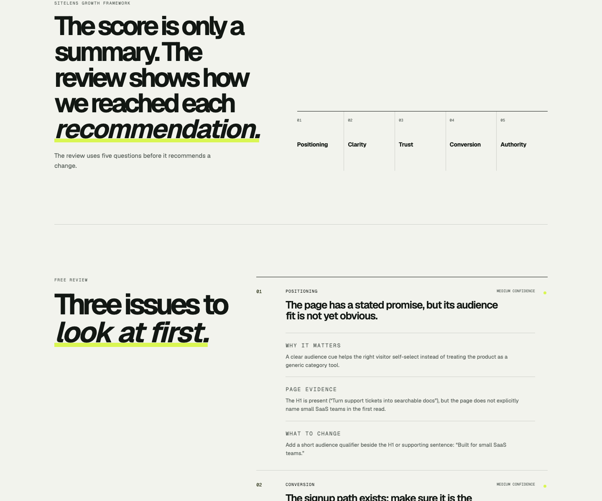
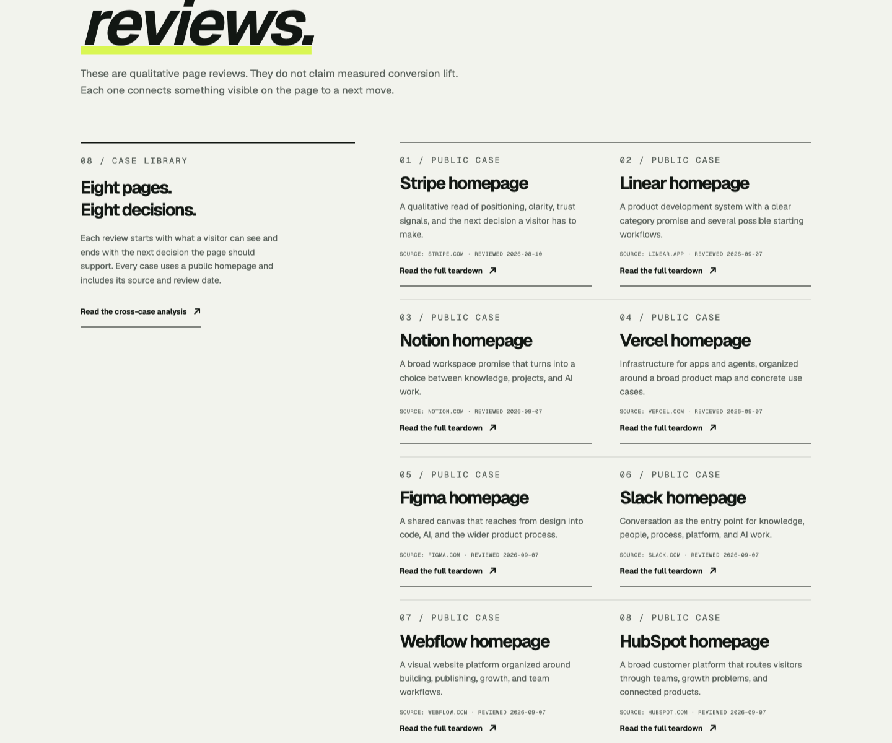

# SiteLens Phase 0

SiteLens Phase 0 是一个面向 Indie Hacker 和小型 SaaS 创始人的网站增长诊断原型。它把公开页面证据整理成一份免费的、可执行的规则诊断报告。

**Live product:** https://sitelens.win · **Public teardown library:** https://sitelens.win/teardowns · **Phase 0 release:** https://github.com/llzclm1/sitelens/releases/tag/v0.1.0 · **Feedback discussion:** https://github.com/llzclm1/sitelens/discussions/1

SiteLens reads one public homepage and connects visible evidence to the first website change worth fixing. It is a qualitative review, not a conversion-rate forecast or a replacement for private analytics and experiments.

## 产品预览






[查看完整发布截图包与证据边界](outputs/launch-assets/README.md)

## 本次实现

- URL + 产品一句话 + 目标用户提交
- 首页 HTML 抓取、跳转限制、超时限制、大小限制与基础 SSRF 防护
- 基于页面证据的免费三问题报告
- 使用确定性的页面规则分析；不调用外部 AI，不把黑盒生成结果当作判断依据
- 公共 Beta 免费开放；没有 Checkout、订阅、账号或邮箱门槛
- Cloudflare D1 持久化报告；本地 `next dev` 无 Cloudflare binding 时才使用内存 fallback
- 首页采用证据驱动的编辑型视觉系统，使用自托管 Geist 字体并支持暗色系统偏好
- 首页展示 SiteLens Growth Framework，提交时展示分析过程；报告提供问题影响、页面证据、修复建议和改写方向
- 提供公开 Teardown Library，包含 8 个基于官方首页的定性案例，并标注来源、日期和分析边界
- 已接入 Google Analytics 4（衡量 ID：`G-YNQ8J06W7D`）和 Google Search Console；首页包含 GSC 验证标签，`robots.txt` 与标准 Next.js `sitemap.xml` 已发布
- API 具备 32 KB 请求体上限、D1 IP 限流和私网 SSRF 拦截；生产响应包含基础安全头
- 提供 `/privacy` 和 `/terms` 页面；GA4/GSC 构建变量带生产回退，避免普通生产构建静默移除标签

## 本地运行

```bash
npm install
cp .env.example .env.local
npm run dev
```

打开 `http://localhost:3000`。分析只依赖公开页面 HTML、元数据、结构、CTA、信任信号、图片 alt 和响应安全头，所有发现都能在报告中回溯到页面证据。

当前生产版本已发布到 Cloudflare Worker `sitelens`，并创建了 `sitelens.win/*` Route。域名通过 Cloudflare Proxied A 记录 `@ → 192.0.2.0` 接入。D1 数据库名为 `sitelens`，初始迁移位于 `migrations/0001_initial.sql`。

## 当前明确不做

- 不承诺真实转化率提升
- 不自动修改用户网站
- 不收集付款信息，也不提供收费或订阅流程
- 不在 Phase 0 里加入独立的竞品监控、GEO 优化服务或企业级审计；现有 Authority/GEO 页面仅作为公开内容和机器可读发现基础

## 下一步验收

1. 用 5–10 个真实公开 SaaS 首页走通提交与报告。
2. 人工检查三条规则问题是否有页面证据、是否能指导一次具体改动。
3. 在 GA4 开始接收数据后检查实时访问，在 Search Console 完成 sitemap 首次抓取后复核索引状态。
